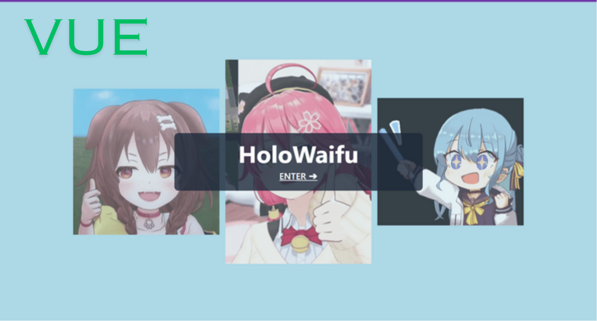
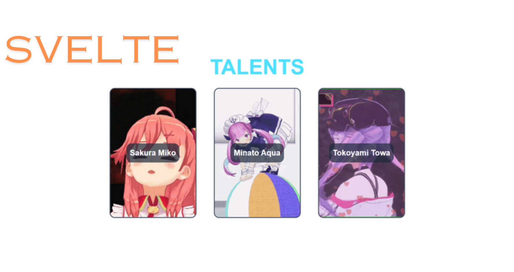
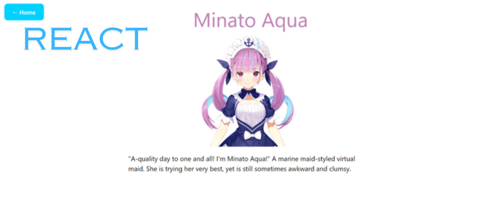

# HoloWaifu

Simple microfrontend site to shows information of some Hololive Member.

## Demo

 
 

#### Landing Page:

#### Home:

#### Detail Page:

## Installation and Setup Instructions

Clone [this repo](https://github.com/mune-kyun/exp-microfe-holowaifu), [main-app](https://github.com/mune-kyun/exp-microfe-holowaifu-main-app), [landing-app](https://github.com/mune-kyun/exp-microfe-landing-component), [list-app](https://github.com/mune-kyun/exp-microfe-list-hololive), [detail-app](https://github.com/mune-kyun/exp-microfe-detail-page) then for each run

`npm install`

then run either

`npm run start` or `npm run serve` depends on the script written in package.json

## Misc

- This project is intended to learn and try out for microfrontend with single-spa.
- Brief description for each part:
  - **holowaifu**: The root config.
  - **holowaifu-main-app** (react): Main app being used to contain others component/page.
  - **landing-component**(vue)
    , **list-hololive**(svelte), **detail-page**(react): Each page is a parcel.
- Inter-component / page communication is done via event dispatch and event listener. For example, when we click the card in the list, we dispatch an event and embed the data in the object property. Then the parent app (holowaifu-main-app) listen to the event and perform action based on it.
- **Stacks**: single-spa, react, vue, svelte, tailwindCSS
